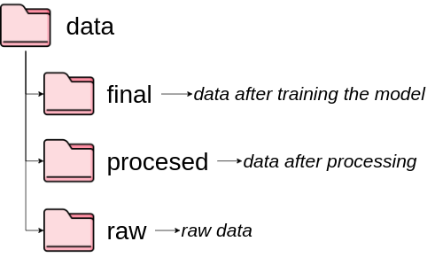

# data



## Introducción

La organización eficiente de los datos es fundamental
para el éxito de cualquier proyecto.

Una estructura clara y consistente facilita el acceso, la gestión y el análisis de los datos,
lo que a su vez mejora la eficiencia y la reproducibilidad del proceso.

Esta estructura se basa en tres categorías principales:

**`data`:** Carpeta principal que contiene todos los datos del proyecto. Se subdivide en:

* **`raw`:** Almacena los datos sin procesar en su formato original (CSV, Excel, parquet, etc.).
* **`processed`:** Contiene los datos después de aplicar transformaciones, limpieza y procesamiento inicial.
* **`final`:** Guarda los datos finales listos para análisis, visualización o modelado.

**Ejemplo:**

```
data/
├── raw/
│   ├── dataset1.csv
│   ├── dataset2.csv
│   └── ...
├── processed/
│   ├── dataset1_processed.csv
│   ├── dataset2_processed.csv
│   └── ...
└── final/
    ├── dataset1_final.csv
    ├── dataset2_final.csv
    └── ...
```

🔑 **Nota**

Es importante tener en cuenta que esta estructura está
diseñada para trabajar localmente. En el caso de trabajar en la nube,
se recomienda almacenar los datos en una base de datos o *data lake*, como Amazon S3, Google Cloud Storage, o Azure Data Lake Storage,
según la plataforma utilizada.


## Beneficios de una estructura organizada

* Facilita la búsqueda y acceso a los datos.
* Permite un mejor seguimiento del procesamiento y análisis.
* Promueve la colaboración y el trabajo en equipo.
* Aumenta la reproducibilidad de los análisis.
