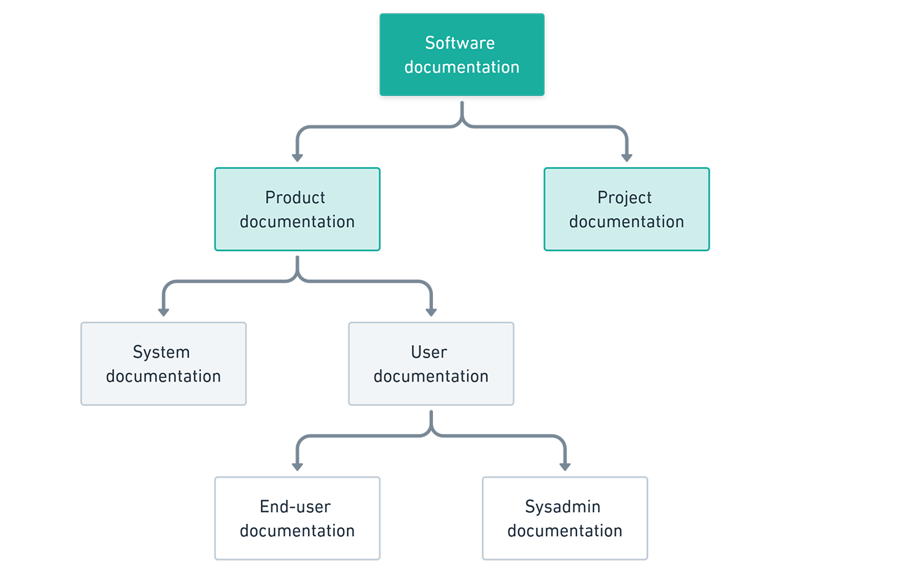

# docs

## Introducción

### Documentación de software

La documentación de software es cualquier
tipo de información escrita o visual que describe el diseño, funcionamiento,
uso y mantenimiento de un sistema de software. Su objetivo principal es facilitar
la comprensión del software y su funcionamiento tanto para los desarrolladores como para los usuarios finales.

### Importancia

La documentación de software es fundamental por varias razones:

1. **Facilita la Comprensión:** Proporciona a los desarrolladores y usuarios una guía clara sobre cómo funciona el software y cómo interactuar con él.

2. **Facilita el Mantenimiento:** Una documentación detallada facilita la identificación y corrección de errores, así como la realización de actualizaciones y mejoras.

3. **Promueve la Colaboración:** Facilita la colaboración entre miembros del equipo al proporcionar un recurso común de referencia.

4. **Reduce la Curva de Aprendizaje:** Permite a los nuevos desarrolladores y usuarios familiarizarse rápidamente con el software.

5. **Aumenta la Confianza del Usuario:** Una documentación clara y completa aumenta la confianza del usuario en el software y en la organización que lo desarrolla.

### Tipos de Documentación

La documentación de software puede clasificarse en varios tipos, dependiendo de su audiencia, propósito y formato. Algunos de los tipos más comunes incluyen:

1. **Documentación de Usuario:** Orientada a los usuarios finales, proporciona instrucciones detalladas sobre cómo instalar, configurar y utilizar el software.

2. **Documentación Técnica:** Dirigida a desarrolladores y profesionales de TI, describe la arquitectura del software, APIs, protocolos de comunicación y otros detalles técnicos.

3. **Documentación de API:** Detalla cómo utilizar las APIs del software, incluyendo los endpoints disponibles, los parámetros de entrada y salida y los ejemplos de uso.

4. **Documentación de Proyecto:** Ofrece información sobre la historia, objetivos, alcance y requisitos del proyecto de software.

5. **Documentación de Código:** Incluye comentarios en el código fuente que explican su funcionamiento, propósito y cualquier otro detalle relevante para los desarrolladores que trabajan en el código.

### Mejores Prácticas

Al crear documentación de software, es importante seguir algunas mejores prácticas:

1. **Clara y Concisa:** La documentación debe ser clara, concisa y fácil de entender, evitando el uso de jerga técnica innecesaria.

2. **Actualizada:** La documentación debe mantenerse actualizada para reflejar los cambios en el software y en los requisitos del usuario.

3. **Completa:** Debe cubrir todos los aspectos importantes del software, desde la instalación y configuración hasta el uso avanzado y la resolución de problemas.

4. **Organizada:** La documentación debe estar organizada de manera lógica y estructurada, utilizando secciones y subsecciones claras.

5. **Accesible:** Debe ser fácilmente accesible para todos los usuarios y desarrolladores, preferiblemente en línea y con una búsqueda fácil.

6. **Ejemplos Prácticos:** Incluir ejemplos prácticos y casos de uso reales puede ayudar a los usuarios a comprender mejor cómo utilizar el software en situaciones reales.

##  MkDocs

### Introducción
[MkDocs](https://squidfunk.github.io/mkdocs-material/) es un generador de sitios web estáticos que facilita la creación de documentación de software utilizando Markdown. MkDocs proporciona una serie de herramientas para crear una documentación completa y profesional:

**1. Plantillas:**

MkDocs incluye una variedad de plantillas prediseñadas que te permiten personalizar el aspecto y la organización de tu documentación. Puedes elegir una plantilla que se ajuste a tu estilo y necesidades, o crear una propia desde cero.

**2. Temas:**

Los temas controlan la apariencia de tu sitio web MkDocs. Puedes elegir un tema predefinido o crear uno propio. Los temas te permiten personalizar la tipografía, los colores, el diseño y otros aspectos visuales de tu documentación.

**3. Extensiones:**

MkDocs tiene una gran colección de extensiones que añaden nuevas funcionalidades a tu sitio web. Puedes encontrar extensiones para:

* **Agregar código a la documentación.**
* **Insertar imágenes y vídeos.**
* **Crear tablas.**
* **Añadir un sistema de búsqueda.**
* **Generar automáticamente un índice de contenido.**
* **Integrar con herramientas de análisis web.**

**4. Markdown:**

MkDocs utiliza Markdown para crear el contenido de la documentación. Markdown es un lenguaje de marcado ligero que te permite escribir texto con formato de forma sencilla y legible. Markdown es ideal para crear documentación técnica porque es fácil de aprender y usar.

**5. CLI:**

MkDocs incluye una interfaz de línea de comandos (CLI) que te permite crear, construir e implementar tu sitio web de documentación. La CLI te permite automatizar tareas y realizar cambios en tu documentación de forma rápida y eficiente.

**6. Integración con Git:**

MkDocs se integra fácilmente con Git, lo que te permite versionar tu documentación y realizar un seguimiento de los cambios. Puedes utilizar Git para colaborar con otros usuarios en la creación de la documentación y para restaurar versiones anteriores de la misma.

### Beneficios de usar MkDocs

* **Facilidad de uso:** MkDocs es una herramienta fácil de aprender y usar, incluso para usuarios sin experiencia en desarrollo web.
* **Flexibilidad:** MkDocs te permite personalizar la apariencia y la organización de tu documentación según tus necesidades.
* **Extensibilidad:** MkDocs tiene una gran colección de extensiones que te permiten añadir nuevas funcionalidades a tu sitio web.
* **Escalabilidad:** MkDocs se puede utilizar para crear sitios web de documentación de cualquier tamaño y complejidad.
* **Gratuito y de código abierto:** MkDocs es una herramienta gratuita y de código abierto, lo que significa que puedes utilizarla y modificarla sin restricciones.
