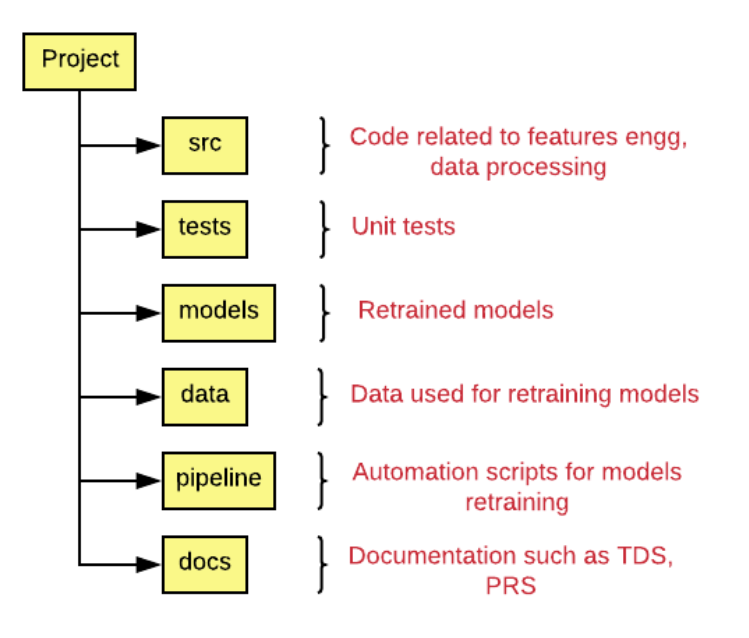

# Estructura de Carpetas



## Estructura Propuesta

La estructura de proyecto propuesta sigue una organización cuidadosamente planificada para facilitar
el desarrollo, la colaboración y la mantenibilidad del proyecto. 

```
├───.github
│   └───workflows
│       └───ci.yml
├───data
│   ├───final
│   ├───procesed
│   └───raw
├───docs
├───models
├───pipeline
├───src
│   ├───_notebooks
│   ├───data
│   ├───preprocessing
│   ├───models
│   └───metrics
├───tests
│ 
├───.gitignore
├───.pre-commit-config.yaml
├───LICENSE
├───mkdocs.yml
├───poetry.lock
├───pyproject.toml
└───README.md
```

### Carpetas

* **.github**: Contiene archivos y carpetas relacionados con la integración y la implementación continua (CI/CD) utilizando GitHub Actions u otras herramientas similares.
* **src**: Carpeta con el código fuente del proyecto organizado en subcarpetas según su funcionalidad
      * `_notebooks`: carpeta con archivos Jupyter Notebook, utilizados para el análisis exploratorio y experimentación de modelos.
      * `data`: Carpeta con las funciones relacionadas con la manipulación de datos.
      * `preprocessing`: Carpeta con las funciones de preprocesamiento de datos.
      * `models`: Carpeta con las funciones asociados a los modelos de Machine Learning (ML).
      * `metrics`: Carpeta con las funciones de evaluación de modelos ML.
* **tests**: Contiene archivos de pruebas unitarias y de integración para el código fuente del proyecto, organizados en subcarpetas según la funcionalidad a la que se refieren, como `data`, `metrics`, `models` y `preprocessing`. También contiene la carpeta `__pycache__` que almacena archivos de caché de las pruebas.
* **models**: Almacena modelos de aprendizaje automático entrenados durante el proyecto.
* **data**: Carpeta con los  datos utilizados en el proyecto, divididos en subcarpetas según su estado de procesamiento: 
      * `raw`: carpeta para los datos sin procesar.
      * `procesed`: carpeta para los datos procesados .
      * `final`: carpeta para los datos finales.
* **pipeline**: Contiene archivos relacionados con el flujo de trabajo del proyecto, como cuadernos Jupyter (`*.ipynb`) utilizados para desarrollar y probar el pipeline, y la carpeta `.ipynb_checkpoints` que puede contener archivos de respaldo generados por Jupyter.
* **docs**: Contiene documentación relacionada con el proyecto, organizada en subcarpetas como `general` para documentación general, `images` para imágenes utilizadas en la documentación, `project` para documentación específica del proyecto, y `_others_` para otros documentos como diagramas y gráficos.

### Archivos

* **.gitignore**: Archivo para especificar qué archivos y carpetas no deben ser rastreados por Git, como archivos binarios o locales y otros generados automáticamente que no deben compartirse.
* **.pre-commit-config.yaml**: Configura ganchos pre-commit para ejecutarse automáticamente antes de cada confirmación en Git, usando la herramienta `pre-commit`.
* **LICENSE**: Contiene los términos y condiciones de la licencia del proyecto, especificando cómo se puede utilizar, distribuir y modificar el código y otros recursos.
* **mkdocs.yml**: Configuración para `MkDocs`, una herramienta que genera documentación estática desde archivos Markdown, definiendo la estructura de la documentación y otras opciones.
* **poetry.lock**: Generado por Poetry, gestor de dependencias de Python, contiene una lista precisa de todas las dependencias y sus versiones exactas para garantizar la consistencia en diferentes entornos.
* **pyproject.toml**: Configuración de Poetry para definir información del proyecto, dependencias, opciones de empaquetado y otras configuraciones relacionadas.
* **README.md**: Principal archivo de markdown del proyecto que proporciona una descripción general, instrucciones de instalación, ejemplos de uso y otra información relevante para los usuarios y colaboradores.

