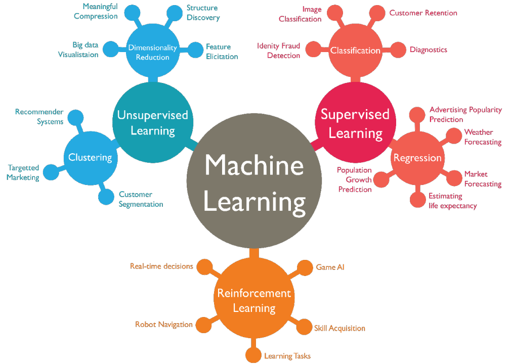

# models



## Introducción

Los modelos de Machine Learning son algoritmos que aprenden patrones y relaciones a partir de datos 
para realizar tareas específicas sin necesidad de ser explícitamente programados. Estos modelos 
pueden ser utilizados para realizar predicciones, clasificaciones, 
clustering, y otras tareas basadas en los datos.

## Tipos de modelos

### Supervised Learning

El **Supervised Learning** es un tipo de aprendizaje automático en el que el modelo aprende a partir de un conjunto de datos etiquetados. Este conjunto de datos contiene ejemplos de entrada (variables independientes) y la salida deseada (variable dependiente). El modelo aprende a mapear las entradas a las salidas mediante un proceso de entrenamiento.

**Tipos de modelos de Supervised Learning:**

* **Regresión:** Se utiliza para predecir un valor numérico continuo a partir de un conjunto de variables independientes. Por ejemplo, predecir el precio de una vivienda, la temperatura en un día determinado o la cantidad de ventas de un producto.

* **Clasificación:** Se utiliza para predecir una categoría discreta a partir de un conjunto de variables independientes. Por ejemplo, clasificar correos electrónicos como spam o no spam, diagnosticar enfermedades o predecir si un cliente hará clic en un anuncio.

### Unsupervised Learning

El **Unsupervised Learning** es un tipo de aprendizaje automático en el que el modelo aprende a partir de un conjunto de datos sin etiquetar. El modelo busca patrones y estructuras en los datos sin ninguna información previa sobre la salida deseada.

**Tipos de modelos de Unsupervised Learning:**

* **Agrupamiento:** Se utiliza para agrupar datos en función de sus similitudes. Por ejemplo, segmentar clientes en diferentes grupos en función de sus hábitos de compra o agrupar genes con funciones similares.

* **Reducción de dimensionalidad:** Se utiliza para disminuir el número de variables en un conjunto de datos sin perder información relevante. Esto puede ser útil para mejorar el rendimiento de otros modelos de ML o para facilitar la visualización de los datos.

### Reinforcement Learning

El **Reinforcement Learning** es un tipo de aprendizaje automático en el que un agente aprende a tomar decisiones en un entorno interactivo. El agente recibe recompensas o penalizaciones por sus acciones, y aprende a tomar las decisiones que le permitan obtener la mayor recompensa posible.

**Tipos de modelos de Reinforcement Learning:**

* **Juegos:** Se utiliza para entrenar agentes para jugar a juegos como ajedrez, Go o videojuegos.
* **Robótica:** Se utiliza para entrenar robots para realizar tareas como caminar, navegar o manipular objetos.
* **Finanzas:** Se utiliza para entrenar agentes para tomar decisiones de inversión o para gestionar carteras de valores.

### Ejemplos

* **Supervised Learning:** Un banco puede utilizar un modelo de Supervised Learning para predecir la probabilidad de que un cliente no pague un préstamo (clasificación) o para predecir la cantidad de dinero que un cliente depositará en su cuenta cada mes (regresión).
* **Unsupervised Learning:** Una empresa de marketing puede utilizar un modelo de Unsupervised Learning para segmentar a sus clientes en diferentes grupos en función de sus hábitos de compra (agrupamiento) o para identificar los factores que más influyen en la decisión de compra de un cliente (reducción de dimensionalidad).
* **Reinforcement Learning:** Un fabricante de robots puede utilizar un modelo de Reinforcement Learning para entrenar un robot para que aprenda a caminar por sí mismo (robótica) o para que aprenda a realizar una tarea específica como ensamblar un producto (robótica).


## Librerías en Python

* **Scikit-learn:** Una de las librerías más populares para ML general.
* **TensorFlow:** Potente framework para deep learning.
* **PyTorch:** Otra opción popular para deep learning.

## Almacenamiento de modelos 

* **Serialización:** Guardar el modelo en un archivo como JSON, pickle o h5py.
* **Bases de datos:** Almacenar el modelo en una base de datos SQL o NoSQL.
* **Ficheros en la nube:** Almacenar el modelo en plataformas como Amazon S3 o Google Cloud Storage.

**Consideraciones al elegir un método de almacenamiento**

* **Tamaño del modelo:** Los modelos grandes pueden requerir soluciones de almacenamiento más robustas.
* **Frecuencia de actualización:** Si el modelo se actualiza con frecuencia, se debe elegir un método que facilite la actualización.
* **Accesibilidad:** El método de almacenamiento debe permitir un acceso rápido y sencillo al modelo.

**Ejemplo de almacenamiento**

```python
import pickle

# Entrenar un modelo
model = ...

# Guardar el modelo
with open('model.pkl', 'wb') as f:
    pickle.dump(model, f)

# Cargar el modelo
with open('model.pkl', 'rb') as f:
    model = pickle.load(f)
```

