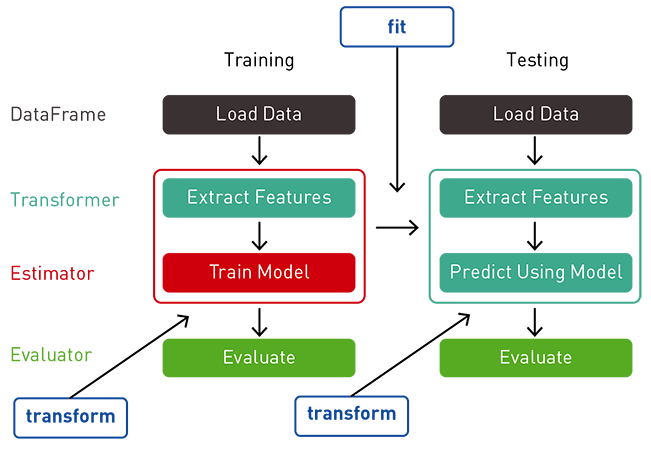

# pipeline



## Introducción


Un pipeline en Machine Learning (ML) es una secuencia de pasos
que automatiza el proceso completo de aprendizaje automático,
desde la carga de datos hasta la evaluación del modelo final. 

En otras palabras, un pipeline agrupa las diferentes etapas del proceso de ML en un flujo de trabajo único y eficiente.


## Componentes de un pipeline

* **Carga de datos:** Carga los datos del origen, como archivos CSV, bases de datos o APIs.
* **Preprocesamiento:** Limpia, transforma y normaliza los datos para prepararlos para el entrenamiento del modelo.
* **Selección de características:** Selecciona las características más relevantes para el modelo.
* **Entrenamiento del modelo:** Entrena un modelo de ML utilizando un algoritmo específico.
* **Evaluación del modelo:** Evalúa el rendimiento del modelo utilizando métricas como precisión, exactitud y curva ROC.
* **Implementación del modelo:** Despliega el modelo en producción para realizar predicciones.

## Beneficios de usar pipelines

* **Automatización:** Agiliza el proceso de ML y reduce el tiempo de desarrollo.
* **Reproducibilidad:** Permite reproducir los resultados de forma consistente.
* **Escalabilidad:** Facilita la aplicación del proceso a conjuntos de datos grandes.
* **Eficiencia:** Optimiza el uso de recursos y reduce el esfuerzo manual.
* **Mejora la calidad del modelo:** Permite identificar y corregir errores en el proceso de ML.

## Herramientas para pipelines

* **Apache Airflow:** Herramienta popular para la orquestación de tareas.
* **Luigi:** Framework de Python para la creación de pipelines.
* **Keras:** Framework de deep learning que incluye herramientas para pipelines.
* **TensorFlow Extended (TFX):** Framework de Google para pipelines de ML.

## Ejemplos

### Azure machine learning

```python
from azureml.core import Workspace, Experiment, Dataset
from azureml.pipeline.core import Pipeline
from azureml.pipeline.steps import PythonScriptStep

# Conectar al área de trabajo de Azure Machine Learning
ws = Workspace.from_config()

# Obtener el conjunto de datos MNIST
mnist_ds = Dataset.get_by_name(ws, name='mnist_dataset')

# Definir los pasos del pipeline
prep_data_step = PythonScriptStep(
    name="prepare_data",
    script_name="prepare_data.py",
    arguments=["--input-dataset", mnist_ds.as_named_input('mnist')],
    outputs=[],
    compute_target="cpu-cluster"
)

train_model_step = PythonScriptStep(
    name="train_model",
    script_name="train_model.py",
    arguments=[],
    inputs=[],
    outputs=[],
    compute_target="gpu-cluster"
)

evaluate_model_step = PythonScriptStep(
    name="evaluate_model",
    script_name="evaluate_model.py",
    arguments=[],
    inputs=[],
    outputs=[],
    compute_target="cpu-cluster"
)

deploy_model_step = PythonScriptStep(
    name="deploy_model",
    script_name="deploy_model.py",
    arguments=[],
    inputs=[],
    outputs=[],
    compute_target="cpu-cluster"
)

# Crear el pipeline
pipeline = Pipeline(workspace=ws, steps=[prep_data_step, train_model_step, evaluate_model_step, deploy_model_step])

# Ejecutar el pipeline
experiment = Experiment(workspace=ws, name='mnist_classification_pipeline')
pipeline_run = experiment.submit(pipeline)
pipeline_run.wait_for_completion(show_output=True)
```

### Vertex AI

```python
from google.cloud import aiplatform
from kfp.v2.google import client

# Configurar el cliente de Vertex AI
aiplatform.init(project="your-project-id", location="us-central1")

# Obtener el bucket de almacenamiento de Google Cloud para los datos
bucket = "gs://your-bucket"

# Definir los pasos del pipeline
prep_data_task = aiplatform.CustomPythonPackageTrainingJob(
    display_name="prep_data",
    python_package_gcs_uri=bucket + "/prep_data.tar.gz",
    python_module_name="prep_data_module",
    container_uri="gcr.io/cloud-aiplatform/training/tf-cpu.2-4:latest",
    model_serving_container_image_uri="gcr.io/cloud-aiplatform/prediction/tf2-cpu.2-4:latest",
)

train_model_task = aiplatform.CustomPythonPackageTrainingJob(
    display_name="train_model",
    python_package_gcs_uri=bucket + "/train_model.tar.gz",
    python_module_name="train_model_module",
    container_uri="gcr.io/cloud-aiplatform/training/tf-cpu.2-4:latest",
    model_serving_container_image_uri="gcr.io/cloud-aiplatform/prediction/tf2-cpu.2-4:latest",
)

evaluate_model_task = aiplatform.CustomPythonPackageTrainingJob(
    display_name="evaluate_model",
    python_package_gcs_uri=bucket + "/evaluate_model.tar.gz",
    python_module_name="evaluate_model_module",
    container_uri="gcr.io/cloud-aiplatform/training/tf-cpu.2-4:latest",
    model_serving_container_image_uri="gcr.io/cloud-aiplatform/prediction/tf2-cpu.2-4:latest",
)

deploy_model_task = aiplatform.Endpoint(
    display_name="deploy_model",
    predict_schemata=None,
    container_uri="gcr.io/cloud-aiplatform/prediction/tf2-cpu.2-4:latest",
)

# Definir el gráfico de flujo del pipeline
graph = client.KubeflowV1beta1PipelineJobSpec(
    steps=[
        client.KubeflowV1beta1PipelineJobSpecStep(
            step_template=prep_data_task,
            arguments={},
        ),
        client.KubeflowV1beta1PipelineJobSpecStep(
            step_template=train_model_task,
            arguments={},
        ),
        client.KubeflowV1beta1PipelineJobSpecStep(
            step_template=evaluate_model_task,
            arguments={},
        ),
        client.KubeflowV1beta1PipelineJobSpecStep(
            step_template=deploy_model_task,
            arguments={},
        ),
    ]
)

# Ejecutar el pipeline
pipeline = client.V1beta1PipelineJob(
    display_name="mnist_classification_pipeline",
    template=graph,
)
pipeline = client.create_pipeline_job(parent="projects/your-project-id/locations/us-central1", pipeline=pipeline)
```
## Consideraciones

La estructura de la carpeta "pipeline" variará dependiendo de la herramienta utilizada para crear y gestionar el pipeline.

Cada herramienta puede tener sus propias convenciones y requisitos específicos para organizar los archivos y recursos relacionados con el pipeline.

Por lo tanto, es importante consultar la documentación oficial de la herramienta específica que esté utilizando para comprender cómo estructurar adecuadamente la carpeta "pipeline" en su proyecto. Esto garantizará una organización coherente y efectiva de los archivos y facilitará la gestión y el mantenimiento del pipeline a lo largo del ciclo de vida del proyecto.