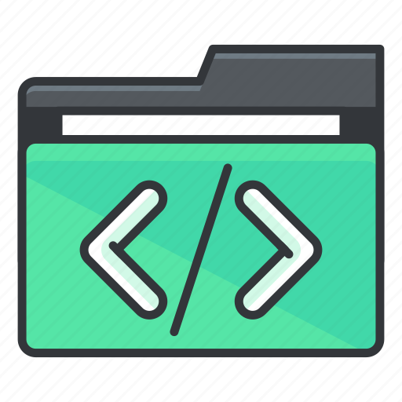

# src



## Introducción

La estructura de carpetas para un proyecto de Machine Learning (ML) 
con Python juega un papel crucial en la organización y la legibilidad del código. 

A continuación, se presenta una estructura de carpetas recomendada:

**`src`:** Carpeta principal que contiene el código fuente del proyecto. Se subdivide en:

* **`_notebooks`:** Almacena archivos Jupyter Notebook para el análisis exploratorio y la experimentación de modelos.
* **`data`:** Contiene las funciones relacionadas con la manipulación de datos, como carga, limpieza y transformación.
* **`preprocessing`:** Guarda las funciones específicas para el preprocesamiento de datos, como normalización, escalado y eliminación de valores atípicos.
* **`models`:** Almacena las funciones que implementan los modelos de ML, incluyendo entrenamiento, evaluación y selección de hiperparámetros.
* **`metrics`:** Contiene las funciones para la evaluación de los modelos ML, como cálculo de precisión, exactitud y curva ROC.

**Ejemplo de organización:**

```
src/
├── _notebooks/
│   ├── experiment_01.ipynb
│   ├── experiment_02.ipynb
│   └── ..
├── data/
│   ├── load_data.py
│   ├── clean_data.py
│   └── transform_data.py
├── preprocessing/
│   └── normalize_data.py
├── models/
│   ├── train_model.py
│   ├── evaluate_model.py
│   └── select_hyperparameters.py
└── metrics/
    └── calculate_metrics.py
```

## Buenas Prácticas en Python

Además de la organización de la carpeta `src`, es importante seguir algunas buenas prácticas al escribir código Python en este contexto:

- **Seguir los Principios SOLID**: Aplicar los principios de diseño SOLID (Single Responsibility, Open/Closed, Liskov Substitution, Interface Segregation, Dependency Inversion) para escribir código modular y flexible.
  
- **Nombrar Conveniente**: Utilizar nombres descriptivos y significativos para variables, funciones y clases que reflejen su propósito y funcionalidad.

- **Documentar el Código**: Incluir comentarios claros y documentación en el código para explicar su funcionamiento, así como el propósito de las funciones y clases.

- **Seguir las Convenciones de Estilo**: Adherirse a las convenciones de estilo de código de Python, como PEP 8, para garantizar la consistencia y legibilidad del código.

- **Utilizar Pruebas Unitarias**: Escribir pruebas unitarias para todas las funciones y clases del código para garantizar su correcto funcionamiento y detectar errores de forma temprana.

- **Gestionar las Dependencias**: Utilizar herramientas de gestión de dependencias, como Poetry o Pipenv, para gestionar las dependencias del proyecto y garantizar la reproducibilidad del entorno de desarrollo.

