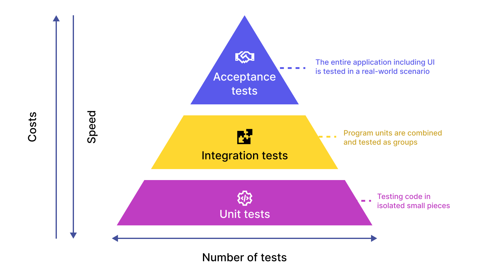

# tests



## Introducción 

El testing, o pruebas de software,
es un proceso fundamental para garantizar la calidad y confiabilidad del software. 
Se basa en ejecutar el código de manera controlada para verificar que se comporta según lo esperado y detectar errores o fallos.

### Tipos de Testing

* **Pruebas unitarias:** Se enfocan en probar unidades individuales de código, como funciones o clases.
* **Pruebas de integración:** Verifican la interacción entre diferentes unidades de código.
* **Pruebas de sistema:** Evalúan el comportamiento del sistema completo en su conjunto.
* **Pruebas de aceptación:** Se realizan desde la perspectiva del usuario para validar que el sistema cumple con sus necesidades.

### Beneficios del Testing

* **Mejora la calidad del software:** Detecta y corrige errores antes de que afecten a los usuarios.
* **Reduce el riesgo de fallos:** Aumenta la confiabilidad del software.
* **Facilita la mantenibilidad del código:** Permite identificar y corregir problemas de diseño o implementación.
* **Aumenta la satisfacción del usuario:** Brinda una mejor experiencia al usuario final.


### Buenas prácticas para Testing

* **Planificar las pruebas:** Definir qué se va a probar y cómo se va a realizar.
* **Escribir pruebas claras y concisas:** Facilitar la comprensión y el mantenimiento de las pruebas.
* **Automatizar las pruebas:** Agilizar el proceso de pruebas y reducir el esfuerzo manual.
* **Documentar las pruebas:** Registrar los resultados de las pruebas para facilitar el seguimiento y la detección de errores.

## Pytest

### Introducción

[pytest](https://docs.pytest.org/en/8.0.x/) es un marco de trabajo de pruebas de software para Python. Facilita la escritura de pruebas unitarias, pruebas de integración y pruebas de aceptación. pytest se basa en la idea de "descubrimiento de pruebas", lo que significa que busca automáticamente archivos y funciones con nombres específicos para ejecutar las pruebas.

**Características clave de pytest**

* **Descubrimiento de pruebas:** Automatiza la búsqueda y ejecución de pruebas.
* **Aserciones:** Permite verificar el comportamiento esperado del código.
* **Fixtures:** Ayudan a preparar y limpiar el entorno de prueba.
* **Parametrización:** Permite ejecutar pruebas con diferentes conjuntos de datos.
* **Integración con otros frameworks:** Se puede integrar con herramientas de cobertura de código y CI/CD.

### Empezando con pytest

Para comenzar con pytest, solo necesitas instalar el paquete `pytest` en tu entorno Python. Luego, puedes crear un archivo con extensión `.py` y escribir tus pruebas.

**Ejemplo de una prueba unitaria con pytest:**

```python
def suma(a, b):
    return a + b

def test_suma():
    assert suma(1, 2) == 3

```

En este ejemplo, la función `suma` se prueba con la función `test_suma`. La aserción verifica que el resultado de la función `suma` con los argumentos `1` y `2` sea `3`.

**Aserciones:**

pytest proporciona una variedad de aserciones para verificar diferentes condiciones:

* `assertEqual(a, b)`: Verifica si dos valores son iguales.
* `assertNotEqual(a, b)`: Verifica si dos valores son diferentes.
* `assertTrue(x)`: Verifica si un valor es True.
* `assertFalse(x)`: Verifica si un valor es False.

**Fixtures:**

Las fixtures son funciones que se ejecutan antes o después de cada prueba. Se pueden usar para preparar el entorno de prueba o para limpiar recursos.

**Ejemplo de una fixture con pytest:**

```python
@pytest.fixture
def setup_database():
    # Conectarse a la base de datos y preparar el entorno

def test_funcion_que_usa_la_base_de_datos(setup_database):
    # Usar la base de datos para la prueba

```

En este ejemplo, la fixture `setup_database` se ejecuta antes de la prueba `test_funcion_que_usa_la_base_de_datos`. Esto permite conectar a la base de datos y preparar el entorno necesario para la prueba.

**Parametrización:**

La parametrización permite ejecutar una prueba con diferentes conjuntos de datos.

**Ejemplo de parametrización con pytest:**

```python
@pytest.mark.parametrize("a, b, expected", [(1, 2, 3), (4, 5, 9)])
def test_suma(a, b, expected):
    assert suma(a, b) == expected

```

### Beneficios de usar pytest

* **Facilidad de uso:** La sintaxis de pytest es simple y fácil de aprender.
* **Flexibilidad:** Permite escribir diferentes tipos de pruebas.
* **Extensibilidad:** Se puede ampliar con plugins para diferentes funcionalidades.
* **Comunidad activa:** Cuenta con una comunidad amplia y activa que ofrece soporte y recursos.

## Referencias

* [Software testing](https://en.wikipedia.org/wiki/Software_testing)
* [Pytest Docs](https://docs.pytest.org/en/latest/)
* [Effective Python Testing With Pytest](https://realpython.com/pytest-python-testing/)
