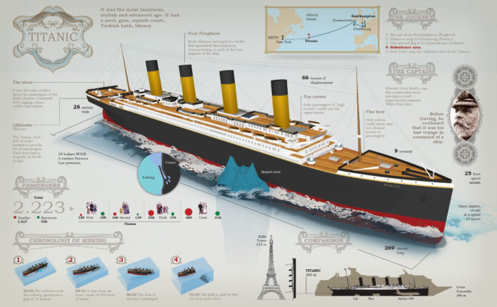

# Caso de estudio

## Desafío

El hundimiento del [Titanic](https://en.wikipedia.org/wiki/Titanic) es uno de los naufragios más infames de la historia.

El 15 de abril de 1912, durante su viaje inaugural, el ampliamente considerado "insubmergible" RMS Titanic se hundió después de chocar con un iceberg. Desafortunadamente, no había suficientes botes salvavidas para todos a bordo, lo que resultó en la muerte de 1502 de los 2224 pasajeros y tripulantes.

Si bien hubo cierto elemento de suerte involucrado en sobrevivir, parece que algunos grupos de personas tenían más probabilidades de sobrevivir que otros.

En este desafío, te pedimos que construyas un modelo predictivo que responda a la pregunta: "¿qué tipo de personas tenían más probabilidades de sobrevivir?" utilizando datos de pasajeros (es decir, nombre, edad, género, clase socioeconómica, etc.).

## Descripción del Dataset

### Overview

Los datos se han dividido en dos grupos:

*   training set (`train.csv`)
*   test set (`test.csv`)

El **training set** debe usarse para construir tus modelos de aprendizaje automático. Para el conjunto de entrenamiento, proporcionamos el resultado (también conocido como "verdad absoluta") para cada pasajero. Tu modelo se basará en "características" como el género y la clase de los pasajeros. También puedes usar [ingeniería de características](https://triangleinequality.wordpress.com/2013/09/08/basic-feature-engineering-with-the-titanic-data/) para crear nuevas características.

El **test set** debe usarse para ver qué tan bien funciona tu modelo en datos invisibles. Para el conjunto de prueba, no proporcionamos la verdad absoluta para cada pasajero. Es tu trabajo predecir estos resultados. Para cada pasajero en el conjunto de prueba, usa el modelo que entrenaste para predecir si sobrevivieron o no al hundimiento del Titanic.

También incluimos **gender\_submission.csv**, un conjunto de predicciones que asumen que todas y solo las pasajeras mujeres sobreviven, como un ejemplo de cómo debería ser un archivo de envío.

###     Diccionario de Datos

| Variable Name | Definition                          | Possible Values                                |
|---------------|-------------------------------------|------------------------------------------------|
| `survival`    | Survival status                     | 0 (No), 1 (Yes)                                |
| `pclass`      | Passenger class                     | 1 (1st), 2 (2nd), 3 (3rd)                      |
| `sex`         | Gender                              | Male, Female                                   |
| `age`         | Age in years                        | Numerical                                      |
| `sibsp`       | Number of siblings/spouses on board | Numerical                                      |
| `parch`       | Number of parents/children on board | Numerical                                      |
| `ticket`      | Ticket number                       | String                                         |
| `fare`        | Passenger fare                      | Numerical                                      |
| `cabin`       | Cabin number                        | String (may contain missing values)            |
| `embarked`    | Port of embarkation                 | C (Cherbourg), Q (Queenstown), S (Southampton) |

### Variable Notes

* **pclass**: Un proxy para el estatus socioeconómico (SES)
      * 1st = Upper
      * 2nd = Middle
      * 3rd = Lower

* **age**: La edad es fraccionaria si es menor que 1. Si la edad se estima, está en forma de xx.5

* **sibsp**: El conjunto de datos define las relaciones familiares de la siguiente manera...
      * Sibling = brother, sister, stepbrother, stepsister
      * Spouse = husband, wife (amantes y prometidos fueron ignorados)

* **parch**: El conjunto de datos define las relaciones familiares de la siguiente manera...
     * Parent = madre, padre
     * Child = daughter, son, stepdaughter, stepson
     * Algunos niños viajaron solo con una niñera, por lo tanto, parch=0 para ellos.

> 🔑 **Nota**: Para obtener más detalles sobre el proyecto, consulta la [documentación de Kaggle](https://www.kaggle.com/c/titanic/overview) sobre el desafío del Titanic.
