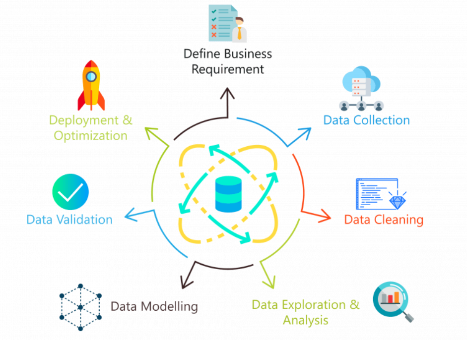

# Descripción del proyecto

## Caso de Estudio
   - **Propósito y Objetivos:** Describe brevemente cuál es el propósito del proyecto y cuáles son los objetivos que esperas lograr.
   - **Contexto:** Proporciona información sobre el contexto del proyecto, como el problema que estás abordando, la industria relevante y cualquier antecedente importante.
   - **Alcance:** Define los límites del proyecto, incluidos los datos que se utilizarán, las técnicas de análisis que se aplicarán y cualquier restricción o limitación relevante.
   - **Público Objetivo:** Identifica a quién está destinada la solución o los resultados del proyecto.

## Ecosistema de Trabajo
   - **Diagramas a Nivel de Código:** Proporciona diagramas que muestren la arquitectura de tu código, incluidos los componentes principales, cómo se relacionan entre sí y cómo fluye la información.
   - **Diagramas a Nivel de Usuario:** Si tu proyecto incluye una interfaz de usuario o algún tipo de interacción con usuarios finales, proporciona diagramas que ilustren cómo interactúan los usuarios con el sistema y cómo se satisfacen sus necesidades.
   - **Diagramas a Nivel de Infraestructura:** Describe la infraestructura necesaria para ejecutar el proyecto, incluidos los servidores, bases de datos, servicios en la nube u otros recursos relevantes. Proporciona diagramas que muestren cómo se interconectan estos componentes y cómo se despliega el sistema en un entorno de producción.

## Principales Resultados
   - **Conclusiones Clave:** Resume los principales resultados o hallazgos del proyecto. Esto puede incluir métricas de rendimiento, insights importantes o conclusiones extraídas del análisis.
   - **Lecciones Aprendidas:** Comparte cualquier lección importante que hayas aprendido durante el desarrollo del proyecto, como desafíos superados, técnicas exitosas o áreas para mejorar en proyectos futuros.
   - **Próximos Pasos:** Sugiere posibles direcciones futuras para el proyecto, como mejoras adicionales, áreas de investigación adicionales o aplicaciones potenciales en el mundo real.
