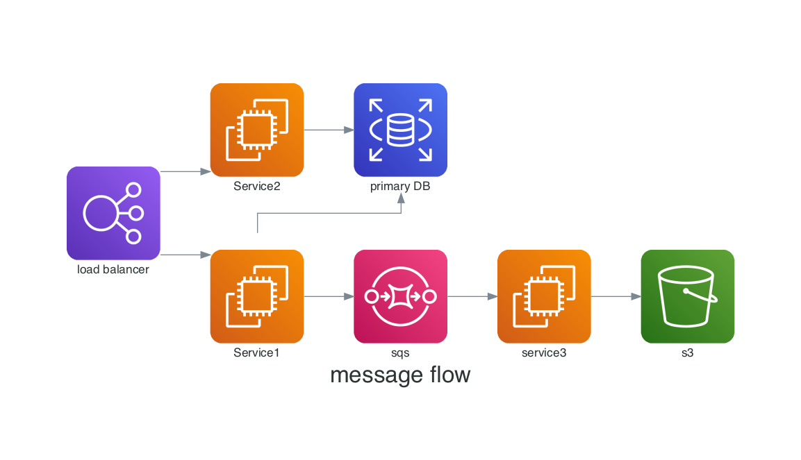

# Recomendaciones

## Herramientas para hacer Diagramas

### Mermaid


[Mermaid](https://mermaid.js.org/#/) es un lenguaje de
marcado ligero para crear diagramas de flujo, organigramas, 
diagramas de red, diagramas de Gantt y más, utilizando texto plano. 

Es una herramienta versátil y fácil de usar que se puede integrar en 
diferentes plataformas, como Markdown, HTML, Confluence, Jira y Visual Studio Code.

**Beneficios de usar Mermaid**

* **Sencillo:** Se basa en una sintaxis intuitiva similar a Markdown, lo que facilita su aprendizaje y uso.
* **Versátil:** Permite crear una amplia variedad de diagramas para diferentes necesidades.
* **Flexible:** Se puede integrar en diversos entornos y plataformas.
* **Portable:** Los diagramas creados con Mermaid son portables y se pueden compartir fácilmente.
* **Libre:** Es una herramienta de código abierto y gratuita.

**Ejemplo**

```terminal
graph LR
A(Start) --> B(Decision)
B --> C(Yes)
C --> D(End)
B --> E(No)
E --> F(End)
```


### Diagrams



[diagrams](https://diagrams.mingrammer.com/) es una biblioteca de Python que
te permite crear diagramas de arquitectura de software y sistemas 
de forma declarativa.

En lugar de dibujarlos manualmente en herramientas como
Visio o Lucidchart, escribes código Python que define los componentes 
y sus relaciones.

**Beneficios de usar diagrams**

* **Integrado con Python:** Se integra naturalmente con el flujo de trabajo de desarrollo orientado a Python.
* **Automatizable:** Los diagramas se pueden generar automáticamente a partir del código fuente, lo que garantiza la coherencia con el sistema real.
* **Versionado:** Los diagramas se pueden versionar junto con el código fuente en tu sistema de control de versiones (como Git).
* **Documentación viva:** Los diagramas actualizados actúan como documentación viva de la arquitectura de tu sistema.
* **Amplia variedad de componentes:** Soporta una biblioteca extensa de componentes para diferentes servicios en la nube, redes, bases de datos, etc.

**Ejemplo**

```python
from diagrams import Diagram
from diagrams.aws.compute import EC2
from diagrams.aws.database import RDS
from diagrams.aws.network import ELB

with Diagram("Web Service", show=False):
    ELB("lb") >> EC2("web") >> RDS("userdb")
```


## Referencias

* [Mermaid Tutorial](https://mermaid.js.org/ecosystem/tutorials.html)
* [Diagrams Tutorial](https://diagrams.mingrammer.com/docs/guides/diagram)
