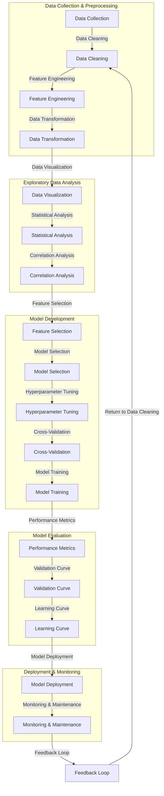
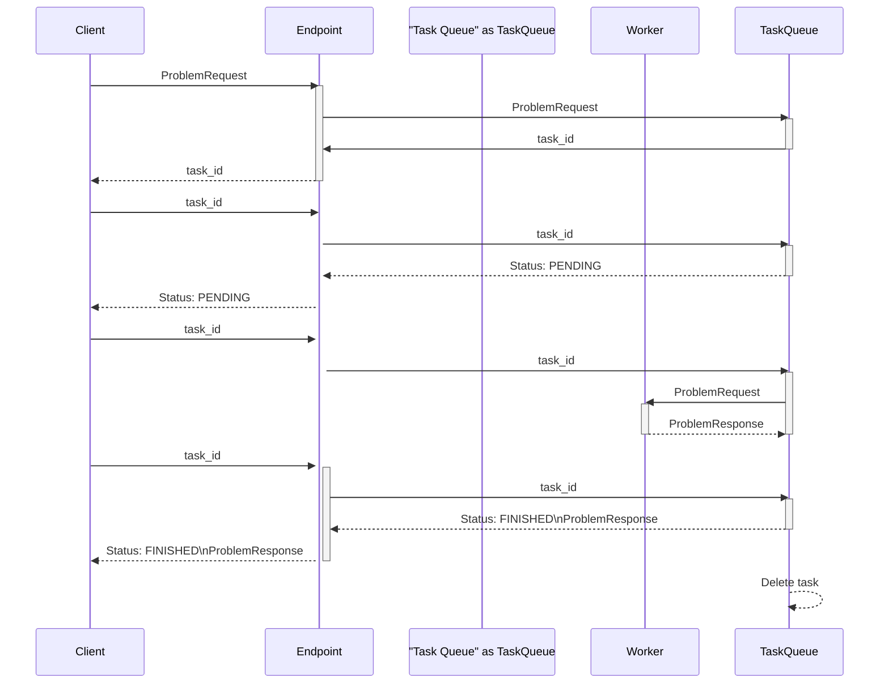
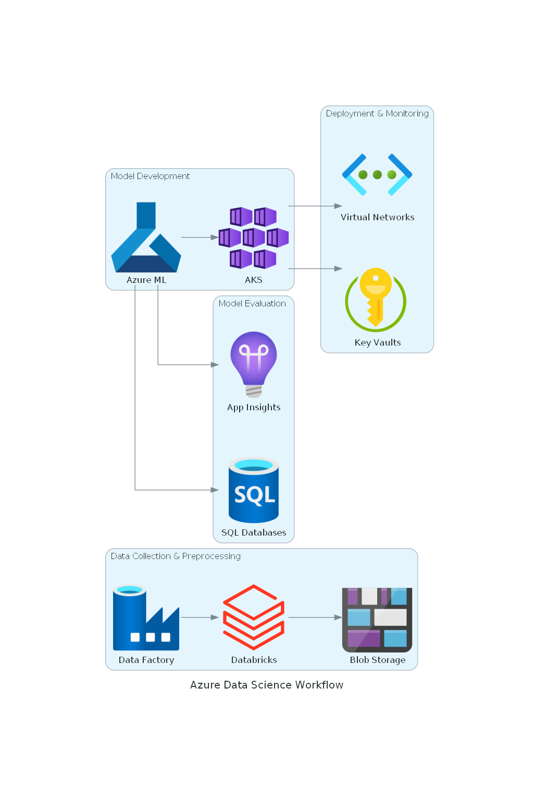

# Ecosistema de trabajo

## Funcionamiento del software

### A nivel de código

``` mermaid
flowchart TD;

    subgraph "Data Collection & Preprocessing"
        A[Data Collection] -->|Data Cleaning| B[Data Cleaning]
        B -->|Feature Engineering| C[Feature Engineering]
        C -->|Data Transformation| D[Data Transformation]
    end

    subgraph "Exploratory Data Analysis"
        D -->|Data Visualization| E[Data Visualization]
        E -->|Statistical Analysis| F[Statistical Analysis]
        F -->|Correlation Analysis| G[Correlation Analysis]
    end

    subgraph "Model Development"
        G -->|Feature Selection| H[Feature Selection]
        H -->|Model Selection| I[Model Selection]
        I -->|Hyperparameter Tuning| J[Hyperparameter Tuning]
        J -->|Cross-Validation| K[Cross-Validation]
        K -->|Model Training| L[Model Training]
    end

    subgraph "Model Evaluation"
        L -->|Performance Metrics| M[Performance Metrics]
        M -->|Validation Curve| N[Validation Curve]
        N -->|Learning Curve| O[Learning Curve]
    end

    subgraph "Deployment & Monitoring"
        O -->|Model Deployment| P[Model Deployment]
        P -->|Monitoring & Maintenance| Q[Monitoring & Maintenance]
    end

    Q -->|Feedback Loop| R[Feedback Loop]

    R -->|Return to Data Cleaning| B

```

### A nivel de usuario

``` mermaid
sequenceDiagram
    participant Client as Client
    participant Endpoint as Endpoint
    participant "Task Queue" as TaskQueue
    participant Worker as Worker

    Client ->> Endpoint: ProblemRequest
    activate Endpoint
    Endpoint ->> TaskQueue: ProblemRequest
    activate TaskQueue
    TaskQueue ->> Endpoint: task_id
    deactivate TaskQueue
    Endpoint -->> Client: task_id
    deactivate Endpoint

    Client ->> Endpoint: task_id
    activate Endpoint
    Endpoint ->> TaskQueue: task_id
    activate TaskQueue
    TaskQueue -->> Endpoint: Status: PENDING
    deactivate TaskQueue
    Endpoint -->> Client: Status: PENDING

    Client ->> Endpoint: task_id
    activate Endpoint
    Endpoint ->> TaskQueue: task_id
    activate TaskQueue
    TaskQueue ->> Worker: ProblemRequest
    activate Worker
    Worker -->> TaskQueue: ProblemResponse
    deactivate Worker
    deactivate TaskQueue

    Client ->> Endpoint: task_id
    activate Endpoint
    Endpoint ->> TaskQueue: task_id
    activate TaskQueue
    TaskQueue -->> Endpoint: Status: FINISHED\nProblemResponse
    deactivate TaskQueue
    Endpoint -->> Client: Status: FINISHED\nProblemResponse
    deactivate Endpoint
    TaskQueue -->> TaskQueue: Delete task

```

### A nivel de infraestructura

